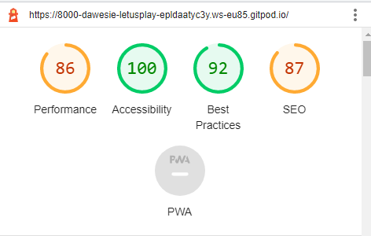

# **Let’s play Rock Paper Scissors**

This is a computer-generated game where the player, plays against the computer that makes a random choice.  Hence there are no biases in the game, as you can’t guess what the compute would do like a you could with a friend or family member.

The player can learn the game very quickly by using the simple rules.  Apart from having fun, the game will help users make decisions.  The game will target both children and adults and can be easily accessed using desktops down to mobile device sizes.

*Image on desk top screen.*

*Image on medium size screens.*

*Image on mobile screen.*

# **Features**

## **Existing features**

- **Header**

The header at the top of the page clearly indicated the games name, and is clearly distinguishable on the background colour.

The header clearly shows what game is being played.

- **Gaming options**

The gaming options give clear instructions to make a choice from the Rock, Paper, Scissors option.  The options are interactive buttons that the player can use to make their choice.  Colour will change when player hovers over a choice. Pictures have been added to the buttons to assist players that are unable to read.

Once a selection is made the game begins.

- **Gaming results**

Once a choice has been made by clicking a button the image on the screen for the player will change to reflect the choice made.

JavaScript code will then make a random choice for the computer and the image will be updated to show the computer’s choice.

Both choices will be assessed using JavaScript code to determine the winner or a draw.  The reulst will be shown and this information will then be used to update the score, again using JavaScript code.

This is valuable to the player as it clearly shows the choices which are being assessed using the rules to detemnie the score.

 

**-The Footer**

The footer section clearly shows the rules of the game and how to start a new game.

This is of value to the user as the rules are clearly visible and can be easily access to monitor progress throughout the game.

 

## **Features left to implement.**

When there is time:

- I would like to extend the game to include lizard and spook options for those player who are fans of The Big Bang series.
- I would also like to add code to extned the game to a make it a best out of three or five option, which will make the game a little more competative.
- I would also like to extend the code to end the game more elegantly, instead of using and alet box. 

# **Testing**
- I tested the programme on a chrome browser, the only secure browser I have access to.
- I confirmed the game results are always correct, and the correct messages appear with the correct results and the scores are updated correctly.
- I confirmed that all the text readable and easy to understand irrespective of screen size.
- I confirmed that the colours and fonts were accessible be running it though lighthouse in dev tools.

 

# **Bugs**
To my knowledge there are no unfixed bugs, I resolved them problems as they arose while I progressed through the code I was developing.

# **Validator testing**
- HTML – no errors found.

 

- CSS - No errors found 

  

- JavaScript -- No errors found just one warning given.

# **Deployment**
The site was deployed through GitHub as follows:
- In the GitHub repository, select project name, then navigate to “setting”, top right of the screen.
- Navigate to “pages” in the menu on the left-hand side of the screen, once in GitHub pages, select none under branch, then select main and then click save.
- This page will then provide a link to the website, listed here:
 https://dawesie.github.io/let-us-play/

**#Credits**
- ## **Content**

Explain me please logic in this game? Rock Paper Scissors is an internet site I accessed to help me consolidate the logic of the game and help me simplify my code.
https://www.codecademy.com/forum_questions/5506b4d551b887b71400858e#:~:text=The%20logic%20is%20that%20you,the%20other%203%20cases%20left.

Used a favicon site to generate the favicon image I am using.
https://favicon.io/favicon-converter/

Jack a fellow coder helped me with lines 138 – 139 to resolve the issue of allowing the player to play attempt 10 before the game is stopped.

- ## **Media**
Pictures used on my site were obtained from the internet, and I modified them for my purposes.
https://media.istockphoto.com/id/839977330/vector/rock-paper-scissors-icons.jpg?s=612x612&w=0&k=20&c=zw4h9XhVAPxHYVY6eOzYHulKyLjq0OWBERlWRwyYMhI=

